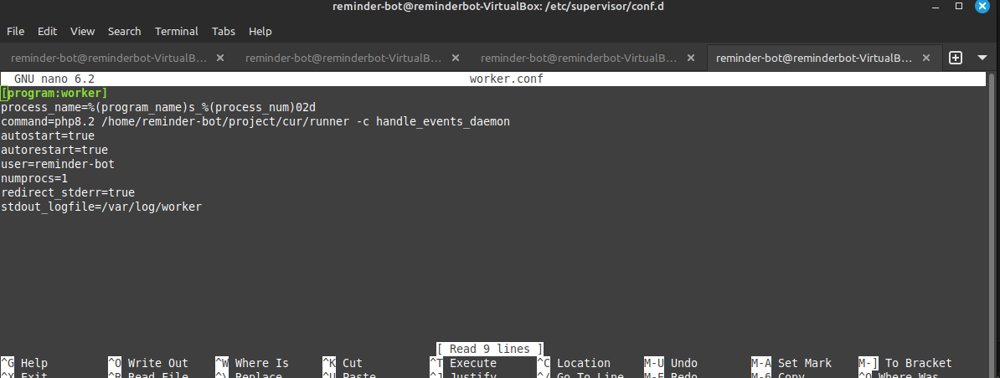
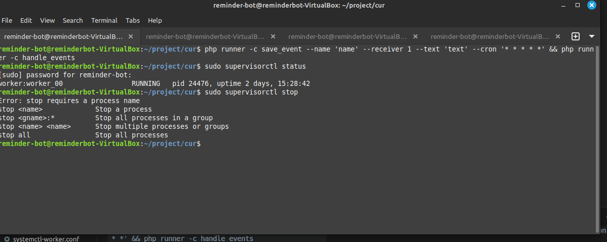

# Домашняя работа
## Скачать и запустить проект локально

### Изменили путь для базы данных в .env файле
`SQLITE_DATABASE="/home/reminder-bot/project/cur/database/database.sqlite"`

### Создаем файл worker.conf  по пути /etc/supervisor/conf.d/

### Запускаем проект 

